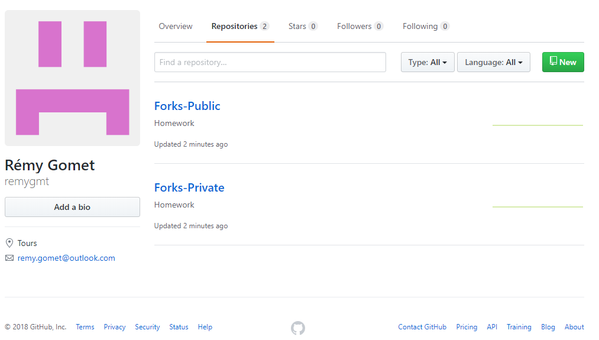

EXERCICES GIT - ENONCE : https://gogs.univ-littoral.fr/tuto/index.html

DEPOT LOCAL :

- Créez un nouveau dépôt local, ajoutez des fichiers et faites quelques modifications+commits ; affichez l'état du dépôt à chaque étape.

On commence par créer un dossier caché .git avec la commande "git init" pour pour pouvoir tracer les fichiers que l'on va versionner. On va utiliser la commande "git init" pour suivre un fichier. Ici par example le ficher texte.txt. Notez que le ficher code.html reste "untraked", non-suivi.

On modifie le fichier texte.txt et on refait un git status. La console nous indique que le contenu du ficher à été modifié. On va ensuite employer la commande git commit pour versionner le fichier texte.txt. Un fichier qui est versionné va être doté d'un matricule qui lui est propre, dans le cas présent : on peut lire 7c51263.

Voici un shéma qui va nous permettre de résumer la situation :

- Renommez et supprimez quelques fichiers.

On peut ensuite se familliarier avec le bit bash et ajouter/modifier/supprimer des ficher et observer ce qui se passe.

- Affichez l'historique des commits et revenez dans un état précédent du dépot. Vérifiez que vos fichiers reviennent bien à l'état correspondant au commit.

  

  

  

  

  La commande git log permet d'avoir un historique des différentes versions de commits éffectués dans le passé.

  - Ajoutez une étiquette à un ancien commit et vérifiez que vous la voyez dans l'historique des commits ou avec un client Git graphique.

  

  

- Testez les suppressions de commits.

  

La commande git reset permet de revenir à une version antécédante : chaque ficher crée, modifié ou supprimé va ainsi être resauré.

DEPOT DISTANT

Exercice 1 :

- Créez un dépôt sur le serveur Gogs et récupérez-le dans un dépôt local.

- Ajoutez/commitez/pushez quelques fichiers et vérifiez sur le site Gogs que les modifications sont bien sur le serveur.

  

La commande git push nous permet d'envoyer le contenu de fichiers versionnés d'un dépôt local vers un dépôt distant (gogs).

La commande gui pull nous permet de récupérer les fichiers présents sur le dépôt distant and un dépot local. Ici on peut voir le contenu importé.

Le contenu du ficher README.md a été modifié et le contenu local a été envoyé au dépôt distant, on peut alors voir la modification depuis le dépôt distant

Exercice 2 (en colloaboration avec Aicha Gamal-Lambert)

- Associez-vous à un ou deux collègues.
- Créez un dépôt sur le serveur Gogs et ajoutez vos collègues comme collaborateurs.
- Récupérez votre dépôt et ajoutez/commitez/pushez quelques fichiers.

Aicha s'est chargée de créer le dépot et m'a ajoutée en tant que collaborateur.

le fichier "message.md" cloné a été modifié puis renvoyé dans le dépot collaboratif distant.

- Demandez à vos collègues de récupérer votre projet.
- Demandez à un collègue de commiter/pusher une modification et vérifiez que vous arrivez à la récupérer de votre côté.

- Faites maintenant des modifications en parallèle sur un même fichier.

- Vérifiez que vous avez bien un conflit, résolvez-le et synchronisez tout le monde.

  Nous avons ensuite chaqun modifié le même message en même temps à partir de la même version du fichier (commit 4b8f) et tout les deux envoyé une commande push.

  Etant donné que nous avons chaqun apporté une modification au sein d'une même version d'un même fichier, un conflit est généré. Il va alors falloir résoudre ce conflit :

BRANCHES

- Clonez un dépôt distant.
- Créez une nouvelle branche `b1`, faites quelques commits dans b1 puis fusionnez-les dans le master.

Création de la branche "branche_initaiale"

Création de quelques commits

- Envoyez la branche `b1` sur le serveur et vérifiez que vous la voyez sur la page web du serveur.
- Créez une branche `b2` à partir du commit précédant le master courant, faites quelques commits dans `b2` puis fusionnez-les dans le master.
- Fusionnez le master dans `b1` et vérifiez le graphe des commits avec le client Git console et avec un client graphique.

FORK

Exercice 1 (en collaboration avec Aicha)

- Associez-vous à un ou deux collègues : l'un d'entre vous doit créer un dépôt public, les autres doivent le forker et soumettre des pull-requests.

Aicha s'est chargée de créer le dépot initial. J'ai ensuite "Fork" ce même dépot ce qui m'a donner un accès au contenu de ce dépot. Je l'ai ensuite modfié et push.

Une fois ma modification enregistrée dans le dépot "forké" je soumet un pull request à Aicha suivi d'un message d'explication.

Aicha reçoit alors une notifiaction concernant mon pull request et accepte d'intérger mes modification issu du dépot que j'ai précément forké.

Exercice 2 (Fait à partir de Github.com)

- Créez deux dépôts distants, l'un publique, l'autre privé.

- Clonez le dépôt privé, faites-y quelques commits et pushez le tout.

- Toujours dans le dépôt privé local, créez une branche "public", fusionnez-y le `master` et pushez-la sur le dépôt distant privé et sur le dépôt distant public

Création d'une branche publique dans le dépôt privé et fusion avec le master

Push de la branche publique du dépôt privé sur le dépôt publique

- Faites un nouveau commit dans le `master`, fusionnez-le dans la branche "public" et pushez le tout.

Création d'un fichier f2 dans le master et fusion avec la branche publique.

- Clonez le dépôt public et mettez-le à jour avec la branche "public" du dépôt distant privé.

FIN

